Part 1 CI Workflow

For this part it was pretty simple, I just made my own repo and added the starter code. I then created a workflow with gradle and updated the depoloyment file to make it build and the screenshots below show that it built perfectly.

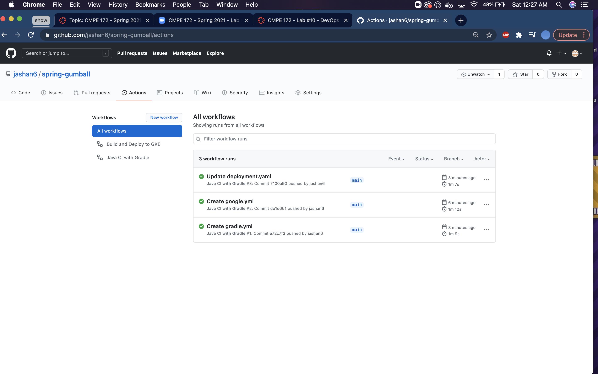

-
-
Part 2 Workflow GKE
For this part, first I created a workflow with gke and made the needed changes to the google.yml file to ensure it worked. Below three screenshots my creation of a key process. First screenshot shows the making of the service account, then making of the key and lastly creating the secrets in github. I had a little trouble here because I put cmpe 172 as the project name and that did not work, I needed to add the id of cmpe 172 to work properly.
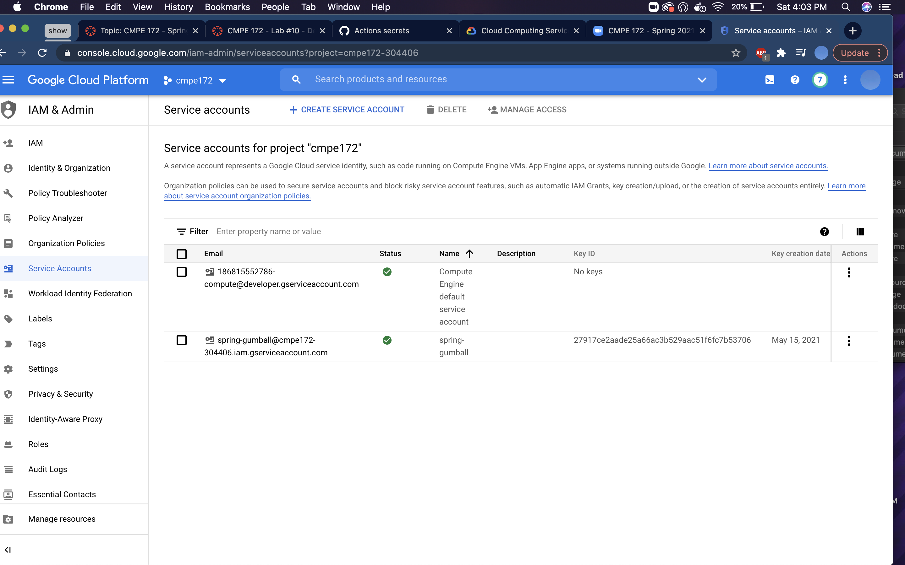
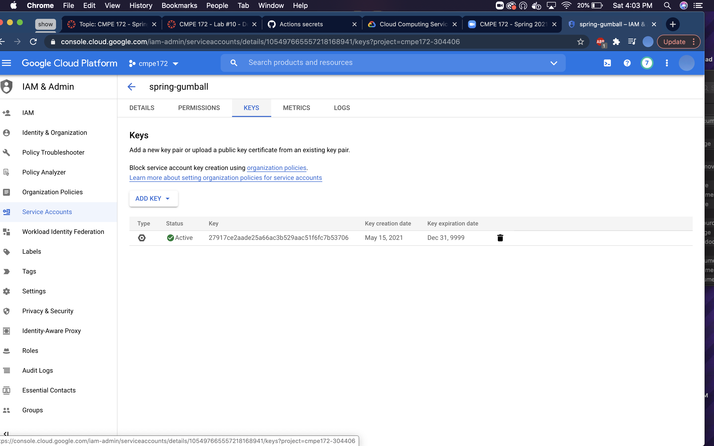
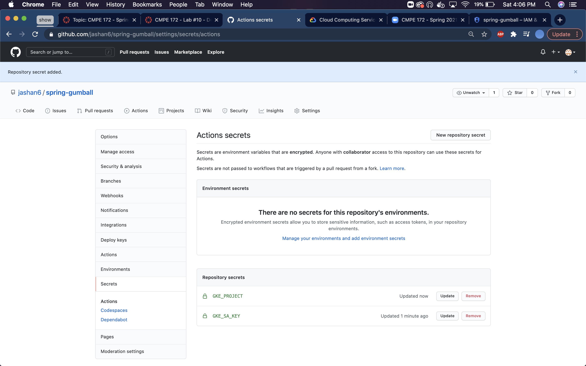

-
-
I then started up my cluster and below the screenshot shows it. When creating the cluster I followed whatever the google.yml file said and filled it in accordingly.
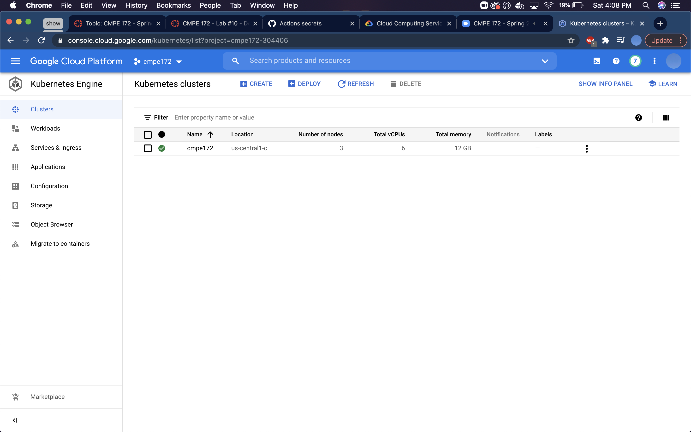

To trigger a build I had to make a new release, by clicking on draft a new release and filling in 1.0 and that is show with the first screenshot and then the one after shows the workflow being built. The last two screenshots show the build process and it went fine and got a green check.
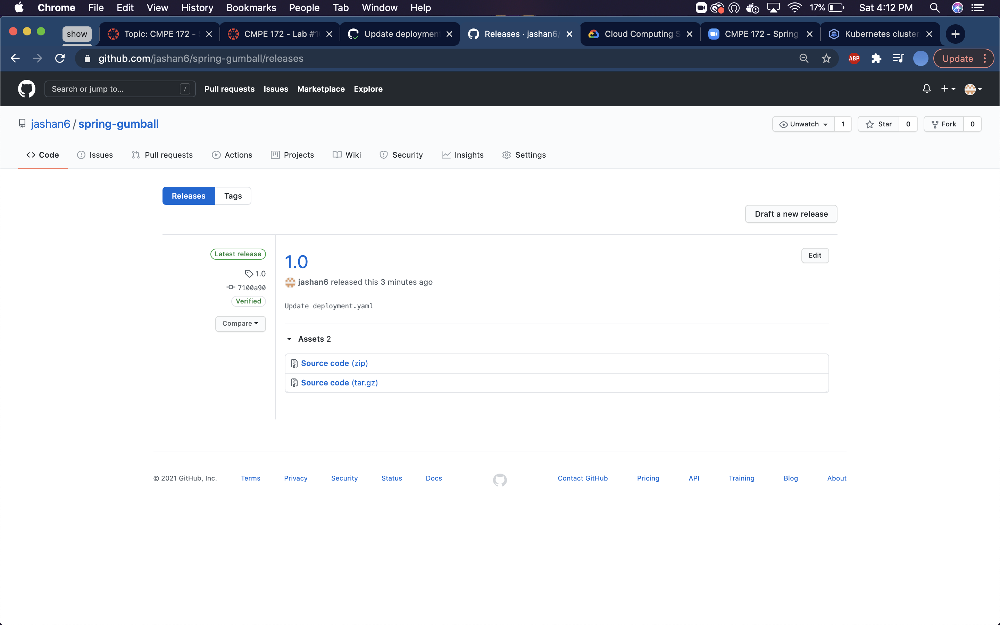

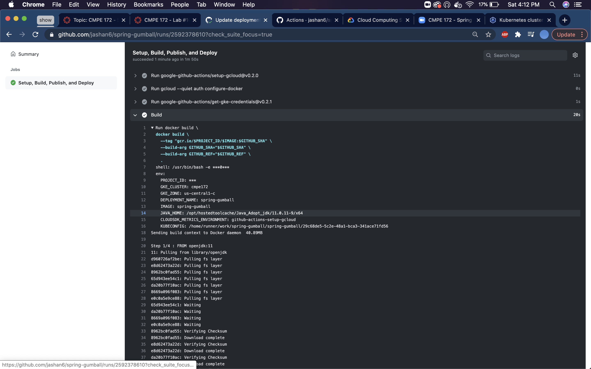
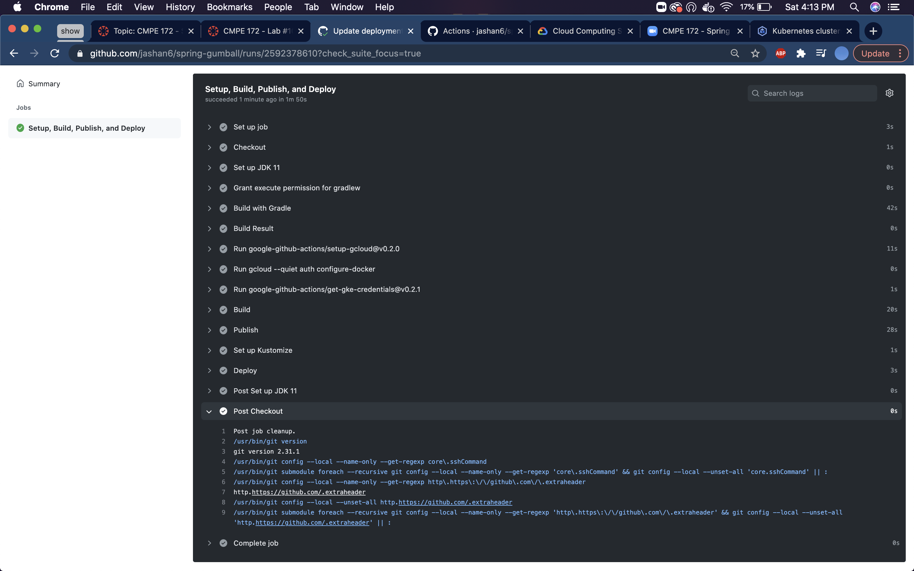

-
-
These next 4 screenshots show the the pods being confirmed, the workloads and service. Then I created an ingress for the load balancer and the last screenshots shows it.
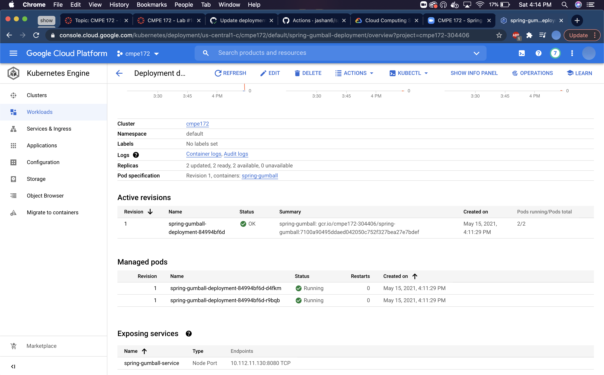
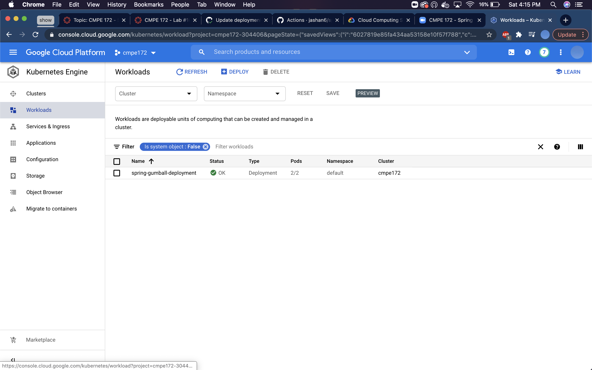
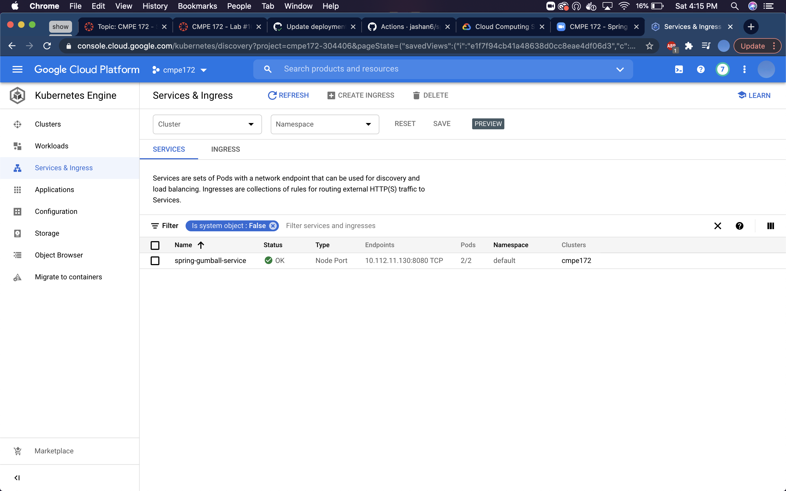
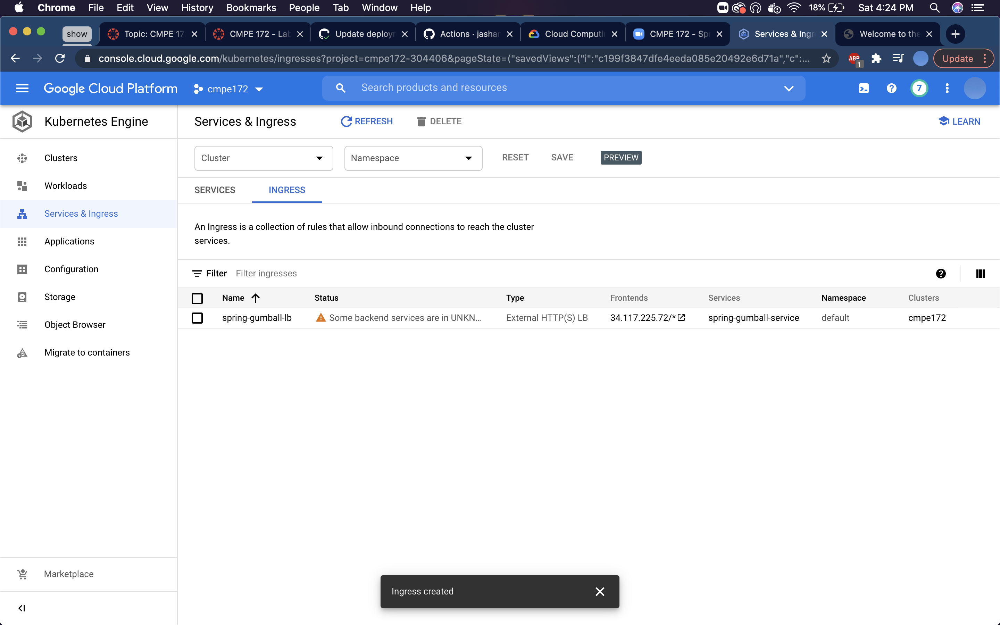

-
-
Lastly it worked perfectly and the gumball image showed up!!
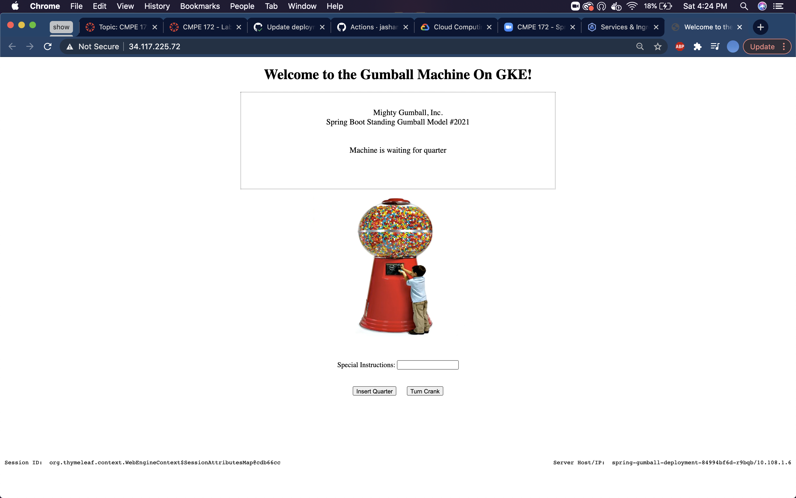

-
-
I didn't have many issues in this lab, only issue of mine was to make sure everything was spelled correctly and the json file was copied properly. Only issue was that I was confused on which project name to put and the cmpe172 was not the right one but the cmpe172-######, or the identification number worked perfectly
